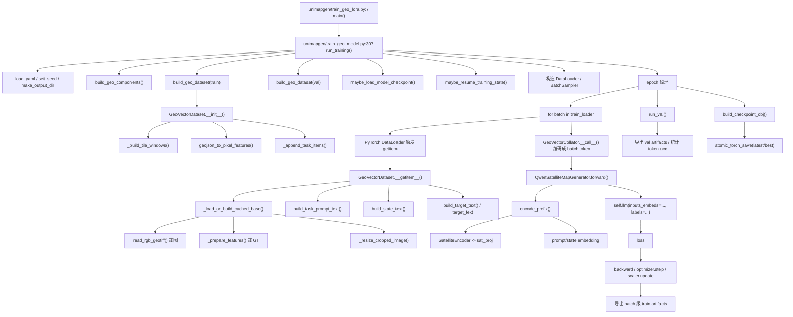

# 训练主链流程图与函数调用清单

本文档从训练入口 `main` 开始，按当前项目代码顺序梳理：

- 训练是如何启动的
- `run_training(...)` 内部如何构造数据、模型、优化器
- `DataLoader` 如何间接调用 `GeoVectorDataset.__getitem__`
- patch 图像与 GeoJSON 真值是在哪里被裁剪的
- prompt / state / target 是在哪里被拼出来的
- DINO 特征和文本是如何一起送进 Qwen 的
- loss、反向传播、验证、checkpoint、中间资产导出是如何串起来的

说明：

- 行号基于当前仓库写本文档时的代码版本
- 第三方库（PyTorch）的调用位置也列出来了，便于追 `__getitem__` 这类间接调用

---

## 1. 总览流程图



---

## 2. 从 main 到 run_training

### 2.1 训练入口

| 定义位置 | 调用位置 | 作用 |
|---|---|---|
| `unimapgen/train_geo_lora.py:7` `main()` | `unimapgen/train_geo_lora.py:15` `run_with_geo_error_boundary(main, default_code=\"GEO-1000\")` | 解析 `--config`，然后进入 `run_training(config_path, mode_override=\"lora\")` |
| `unimapgen/train_geo_model.py:307` `run_training(config_path, mode_override=\"\")` | `unimapgen/train_geo_lora.py:11` | 训练主入口，后续所有构建、训练、验证、保存都在这里发生 |

### 2.2 `run_training(...)` 开始阶段

| 被调用函数 | 定义位置 | 调用位置 | 作用 |
|---|---|---|---|
| `load_yaml(...)` | `unimapgen/utils.py` | `unimapgen/train_geo_model.py:309` | 读取 YAML 配置 |
| `set_seed(...)` | `unimapgen/utils.py` | `unimapgen/train_geo_model.py:314` | 固定随机种子 |
| `make_output_dir(...)` | `unimapgen/geo/pipeline.py:294` | `unimapgen/train_geo_model.py:319` | 创建本次训练输出目录 |
| `build_geo_components(...)` | `unimapgen/geo/pipeline.py:158` | `unimapgen/train_geo_model.py:341` | 构建 `task_schemas / text_tokenizer / collator / model` |
| `build_geo_dataset(...)` | `unimapgen/geo/pipeline.py:64` | `unimapgen/train_geo_model.py:345`、`354` | 构建训练集和验证集 |
| `maybe_load_model_checkpoint(...)` | `unimapgen/geo/pipeline.py:213` | `unimapgen/train_geo_model.py:364` | 加载已有模型权重 |
| `export_tile_audit_records(...)` | `unimapgen/geo/artifacts.py` | `unimapgen/train_geo_model.py:370`、`380` | 导出 patch 审计与 patch 预览图 |
| `maybe_resume_training_state(...)` | `unimapgen/geo/pipeline.py:266` | `unimapgen/train_geo_model.py:469` | 恢复 optimizer / scaler / epoch / global_step |
| `_count_sample_batches(...)` | `unimapgen/train_geo_model.py:67` | `unimapgen/train_geo_model.py:480` | 统计每个 sample 对应多少 patch batch |
| `_group_sample_indices(...)` | `unimapgen/train_geo_model.py:79` | `unimapgen/train_geo_model.py:456` | 按 sample_id 把 patch 索引分组并排序 |

---

## 3. 数据集构建阶段

### 3.1 `build_geo_dataset(...)`

| 被调用函数 | 定义位置 | 调用位置 | 作用 |
|---|---|---|---|
| `select_enabled_task_schemas(...)` | `unimapgen/geo/pipeline.py:35` | `unimapgen/geo/pipeline.py:78` | 根据配置筛出启用的任务 |
| `get_stage_tiling_cfg(...)` | `unimapgen/geo/pipeline.py:46` | `unimapgen/geo/pipeline.py:88` | 读取 train / eval / predict 对应的 tiling 配置 |
| `GeoVectorDataset(...)` | `unimapgen/geo/dataset.py:89` | `unimapgen/geo/pipeline.py:152` | 实例化数据集对象 |

### 3.2 `GeoVectorDataset.__init__(...)`

| 被调用函数 | 定义位置 | 调用位置 | 作用 |
|---|---|---|---|
| `read_raster_meta(...)` | `unimapgen/geo/io.py` | `unimapgen/geo/dataset.py:113` | 读 tif 元信息，不裁图 |
| `read_binary_mask(...)` | `unimapgen/geo/io.py` | `unimapgen/geo/dataset.py:117` | 读 review mask |
| `compute_mask_bbox(...)` | `unimapgen/geo/geometry.py` | `unimapgen/geo/dataset.py:118` | 计算 mask 外接框 |
| `expand_bbox(...)` | `unimapgen/geo/geometry.py` | `unimapgen/geo/dataset.py:122` | 在 mask bbox 上加 pad，形成 crop bbox |
| `_build_tile_windows(...)` | `unimapgen/geo/dataset.py:617` | `unimapgen/geo/dataset.py:140` | 生成整张大图的 patch 窗口 |
| `load_geojson(...)` | `unimapgen/geo/io.py` | `unimapgen/geo/dataset.py:160` | 读 GeoJSON 真值文件 |
| `geojson_to_pixel_features(...)` | `unimapgen/geo/io.py` | `unimapgen/geo/dataset.py:159` | 把 GeoJSON 转成内部像素坐标几何 |
| `_append_task_items(...)` | `unimapgen/geo/dataset.py` | `unimapgen/geo/dataset.py:164` | 把每个 patch / task 展开成 `self.items` 里的样本项 |

### 3.3 `_build_tile_windows(...)`

定义位置：

- [dataset.py](../unimapgen/geo/dataset.py#L617)

调用位置：

- [dataset.py](../unimapgen/geo/dataset.py#L140)

作用：

- 根据整张大图尺寸、review bbox、tiling 参数生成 patch 窗口
- 为每个 patch 统计 mask 覆盖率
- 调 `audit_tile_window_selection(...)` 筛掉无效 patch
- 输出后续真正裁图要用的 `crop_bbox / tile_window`

它内部依赖：

| 内部调用函数 | 定义位置 | 调用位置 |
|---|---|---|
| `expand_bbox(...)` | `unimapgen/geo/geometry.py` | `unimapgen/geo/dataset.py:645` |
| `generate_tile_windows(...)` | `unimapgen/geo/geometry.py` | `unimapgen/geo/dataset.py:651` |
| `annotate_tile_windows_with_mask(...)` | `unimapgen/geo/geometry.py` | `unimapgen/geo/dataset.py:659` |
| `audit_tile_window_selection(...)` | `unimapgen/geo/geometry.py` | `unimapgen/geo/dataset.py:660` |

---

## 4. DataLoader 如何调用 `__getitem__`

### 4.1 项目里的触发点

| 位置 | 作用 |
|---|---|
| `unimapgen/train_geo_model.py:605` | 单个 sample epoch 模式下构建 `train_loader` |
| `unimapgen/train_geo_model.py:617`、`628` | 普通训练模式下构建 `train_loader` |
| `unimapgen/train_geo_model.py:414`、`427` | 构建 `val_loader` |
| `unimapgen/train_geo_model.py:644` | 训练循环：`for batch_index, batch in enumerate(pbar):` |
| `unimapgen/train_geo_model.py:264` | 验证循环：`for batch_index, batch in enumerate(iterator):` |

### 4.2 PyTorch 内部真正调用的位置

| 第三方位置 | 作用 |
|---|---|
| `torch/utils/data/dataloader.py:801` | `self._dataset_fetcher.fetch(index)` |
| `torch/utils/data/_utils/fetch.py:54` | batched 情况：`data = [self.dataset[idx] for idx in possibly_batched_index]` |
| `torch/utils/data/_utils/fetch.py:56` | 单样本情况：`data = self.dataset[possibly_batched_index]` |

也就是说，项目里虽然看不到手写 `dataset.__getitem__(...)`，但在 `for batch in loader` 时，PyTorch 最终会调用到：

- `unimapgen/geo/dataset.py:192` `GeoVectorDataset.__getitem__`

---

## 5. `__getitem__` 到裁图、裁真值、拼 prompt 的主链

### 5.1 `GeoVectorDataset.__getitem__(...)`

定义位置：

- [dataset.py](../unimapgen/geo/dataset.py#L192)

直接调用位置：

- `PyTorch DataLoader` 间接触发，见上一节

内部关键调用：

| 被调用函数 | 定义位置 | 调用位置 | 作用 |
|---|---|---|---|
| `_load_or_build_cached_base(...)` | `unimapgen/geo/dataset.py:337` | `unimapgen/geo/dataset.py:216` | 读取或构建 patch 基础裁剪结果 |
| `uv_feature_records_to_target_items(...)` | `unimapgen/geo/coord_sequence.py` | `unimapgen/geo/dataset.py:245` | 把 target 几何转成结构化中间项 |
| `uv_feature_records_to_state_items(...)` | `unimapgen/geo/coord_sequence.py` | `unimapgen/geo/dataset.py:250` | 把 state 几何转成结构化中间项 |
| `build_task_prompt_text(...)` | `unimapgen/geo/prompting.py:71` | `unimapgen/geo/dataset.py:256` | 构造 `prompt_text` |
| `pixel_features_to_geojson(...)` | `unimapgen/geo/io.py` | `unimapgen/geo/dataset.py:265`、`270` | 把当前 patch 的 state/target 几何回写成 GeoJSON |
| `build_state_text(...)` | `unimapgen/geo/prompting.py:108` | `unimapgen/geo/dataset.py:277` | 构造 `state_text` |
| `build_target_text(...)` | `unimapgen/geo/prompting.py:132` | `unimapgen/geo/dataset.py:282` | 构造 `target_meta_text` |

### 5.2 `_load_or_build_cached_base(...)`

定义位置：

- [dataset.py](../unimapgen/geo/dataset.py#L337)

调用位置：

- [dataset.py](../unimapgen/geo/dataset.py#L216)

作用：

- 优先从 cache 读取 patch 基础结果
- cache 未命中时，真正按 `crop_bbox` 裁 tif
- 按 review mask 处理图像
- 为当前 patch 和 state strip 分别裁真值几何
- resize patch 图像
- 将结果回写 cache

内部关键调用：

| 被调用函数 | 定义位置 | 调用位置 | 作用 |
|---|---|---|---|
| `read_rgb_geotiff(...)` | `unimapgen/geo/io.py:78` | `unimapgen/geo/dataset.py:369` | 按 `crop_bbox` 从原始 tif 裁 patch 图像 |
| `read_binary_mask(...)` | `unimapgen/geo/io.py` | `unimapgen/geo/dataset.py:374` | 读 review mask |
| `_apply_review_mask_to_image(...)` | `unimapgen/geo/dataset.py` | `unimapgen/geo/dataset.py:378` | 把图像中不可信区域清零 |
| `build_resize_context(...)` | `unimapgen/geo/geometry.py` | `unimapgen/geo/dataset.py:385` | 生成 resize/pad 几何关系 |
| `_resize_cropped_image(...)` | `unimapgen/geo/dataset.py:316` | `unimapgen/geo/dataset.py:391` | patch 图像 resize 到模型输入大小 |
| `_prepare_features(...)` | `unimapgen/geo/dataset.py:826` | `unimapgen/geo/dataset.py:395`、`409` | 裁 patch GT 和 state GT |

### 5.3 `read_rgb_geotiff(...)`

定义位置：

- [io.py](../unimapgen/geo/io.py#L78)

调用位置：

| 调用位置 | 作用 |
|---|---|
| `unimapgen/geo/dataset.py:369` | 训练/验证阶段按 patch 裁 tif |
| `unimapgen/geo/artifacts.py:86` | 导出 patch 预览图 |
| `unimapgen/geo/inference.py:512` | 推理阶段按 patch 读图 |

### 5.4 `_prepare_features(...)`

定义位置：

- [dataset.py](../unimapgen/geo/dataset.py#L826)

调用位置：

| 调用位置 | 作用 |
|---|---|
| `unimapgen/geo/dataset.py:395` | 生成当前 patch 的 target 几何 |
| `unimapgen/geo/dataset.py:409` | 生成左/上边界 state 几何 |

作用：

- 对 lane / intersection 真值做稳定排序
- 按 review mask 过滤不可信几何
- 按 `crop_bbox` 把几何裁到当前 patch
- 按 `state_bboxes` 再裁出左/上邻接先验
- 给被裁断的线/面打 `cut_start / cut_end / clipped`
- 做重采样

内部关键调用（与“裁 GeoJSON 线/面”直接相关）：

| 被调用函数 | 定义位置 | 调用位置 | 作用 |
|---|---|---|---|
| `_line_mask_segments(...)` | `unimapgen/geo/dataset.py:725` | `unimapgen/geo/dataset.py:950` | 先按 mask 把 lane 拆成可信线段 |
| `_line_piece_cut_flags_after_clip(...)` | `unimapgen/geo/dataset.py:768` | `unimapgen/geo/dataset.py:965` | 线裁断后计算 `cut_start / cut_end` |
| `feature_intersects_bbox(...)` | `unimapgen/geo/geometry.py:448` | `unimapgen/geo/dataset.py:875`、`898`、`958`、`986` | 判断 feature 是否与 patch/state bbox 相交 |
| `clip_polygon_rings_to_bbox(...)` | `unimapgen/geo/geometry.py:485` | `unimapgen/geo/dataset.py:877`、`900` | 裁 polygon rings |
| `clip_feature_to_bbox(...)` | `unimapgen/geo/geometry.py:460` | `unimapgen/geo/dataset.py:959`、`988` | 裁 polyline |
| `resample_feature_points(...)` | `unimapgen/geo/geometry.py` | `unimapgen/geo/dataset.py:916`、`1009` | 对裁后的几何重采样 |

---

## 6. Collator：把文本变成 batch token

### 6.1 `GeoVectorCollator.__call__(...)`

定义位置：

- [dataset.py](../unimapgen/geo/dataset.py#L1194)

谁把它传给 `DataLoader`

| 调用位置 | 说明 |
|---|---|
| `unimapgen/geo/pipeline.py:191` | 创建 `collator = GeoVectorCollator(...)` |
| `unimapgen/train_geo_model.py:99` | `_build_subset_loader(..., collate_fn=collator)` |
| `unimapgen/train_geo_model.py:421`、`434`、`497`、`508`、`622`、`633` | 各种 `DataLoader(..., collate_fn=collator)` |

作用：

- 把 `__getitem__` 返回的 `prompt_text / state_text / target_text`
  交给 tokenizer 编成 token id
- padding 成 batch 张量
- 返回：
  - `prompt_input_ids`
  - `state_input_ids`
  - `map_input_ids`
  - 对应 attention mask
  - 以及调试用的原始文本和元数据

---

## 7. 模型前向：DINO + prompt/state -> Qwen

### 7.1 训练循环中调用模型

调用位置：

- [train_geo_model.py](../unimapgen/train_geo_model.py#L676) 训练前向
- [train_geo_model.py](../unimapgen/train_geo_model.py#L266) 验证前向

对应模型函数：

- `unimapgen/models/qwen_map_generator.py:281` `forward(...)`

### 7.2 `forward(...)`

定义位置：

- [qwen_map_generator.py](../unimapgen/models/qwen_map_generator.py#L281)

内部关键调用：

| 被调用函数 | 定义位置 | 调用位置 | 作用 |
|---|---|---|---|
| `encode_prefix(...)` | `unimapgen/models/qwen_map_generator.py:231` | `unimapgen/models/qwen_map_generator.py:293` | 构建视觉前缀 + prompt/state 前缀 |
| `self.llm.get_input_embeddings()(map_input_ids)` | `Qwen` | `unimapgen/models/qwen_map_generator.py:301` | 把 target token id 变成 embedding |
| `self.llm(inputs_embeds=..., labels=...)` | `Qwen` | `unimapgen/models/qwen_map_generator.py:314` | 计算语言模型 loss |

### 7.3 `encode_prefix(...)`

定义位置：

- [qwen_map_generator.py](../unimapgen/models/qwen_map_generator.py#L231)

作用：

- 用 DINO 提取视觉 token
- 用 `sat_proj` 把 DINO hidden size 映射到 Qwen hidden size
- 把 `prompt_input_ids / state_input_ids` 通过 Qwen embedding 表转成 embedding
- 把：
  - 视觉 token
  - prompt embedding
  - state embedding
  拼成一个统一的 `prefix_embeds`

内部关键调用：

| 被调用函数/模块 | 调用位置 | 作用 |
|---|---|---|
| `self.sat_encoder(image)` | `unimapgen/models/qwen_map_generator.py:242` | DINO 提取视觉 token |
| `self.sat_proj(sat_tokens)` | `unimapgen/models/qwen_map_generator.py:246` | 模态转换器，把 DINO 特征投影到 Qwen hidden size |
| `self.llm.get_input_embeddings()(prompt_input_ids)` | `unimapgen/models/qwen_map_generator.py:265` | prompt 文本转 embedding |
| `self.llm.get_input_embeddings()(state_input_ids)` | `unimapgen/models/qwen_map_generator.py:271` | state 文本转 embedding |

---

## 8. 反向传播、导出、验证、保存

### 8.1 patch 级训练

训练循环位置：

- [train_geo_model.py](../unimapgen/train_geo_model.py#L644)

关键步骤：

| 调用位置 | 作用 |
|---|---|
| `train_geo_model.py:659` | 计算当前 step 的学习率 |
| `train_geo_model.py:676` | 调 `model(...)` 做前向 |
| `train_geo_model.py:689` | `scaler.scale(loss).backward()` |
| `train_geo_model.py:693` | `clip_grad_norm_` |
| `train_geo_model.py:694` | `scaler.step(optimizer)` |
| `train_geo_model.py:695` | `scaler.update()` |

### 8.2 导出 patch 级中间资产

调用位置：

- [train_geo_model.py](../unimapgen/train_geo_model.py#L733) `export_batch_geojson_snapshots(...)`
- [train_geo_model.py](../unimapgen/train_geo_model.py#L290) 验证阶段也会导出

定义位置：

- `unimapgen/geo/artifacts.py:156` `export_batch_geojson_snapshots(...)`

作用：

- 导出：
  - `patch.png`
  - `patch.resized.png`
  - `prompt.txt`
  - `state.txt`
  - `target.txt`
  - `Lane.gt.geojson`
  - `Lane.pred.geojson`
  - `Lane.pred.raw.txt`
  - `Lanecut.pred.geojson`
  - `Lanecut.txt`
  - 以及 stitched summary 等

### 8.3 整图 stitch

调用位置：

- [train_geo_model.py](../unimapgen/train_geo_model.py#L758) 之后整段 stitched 逻辑

相关函数：

| 被调用函数 | 定义位置 | 调用位置 | 作用 |
|---|---|---|---|
| `deduplicate_feature_records(...)` | `unimapgen/geo/metrics.py` | `unimapgen/train_geo_model.py:771` | patch 级预测拼成整图前去重/融合 |
| `save_geojson_snapshot(...)` | `unimapgen/geo/artifacts.py:68` | `unimapgen/train_geo_model.py:778`、`784` | 写整图 `Lane.geojson / Intersection.geojson` |
| `save_json(...)` | `unimapgen/geo/artifacts.py:62` | `unimapgen/train_geo_model.py:793` | 写 stitched summary |

### 8.4 验证

函数定义：

- [train_geo_model.py](../unimapgen/train_geo_model.py#L240) `run_val(...)`

调用位置：

- [train_geo_model.py](../unimapgen/train_geo_model.py#L797)

作用：

- 遍历 `val_loader`
- 调模型前向计算 `val_loss`
- 统计 token-level accuracy
- 可选导出验证 patch 的 GT / Pred / raw text

### 8.5 checkpoint 保存

| 被调用函数 | 定义位置 | 调用位置 | 作用 |
|---|---|---|---|
| `build_checkpoint_obj(...)` | `unimapgen/geo/pipeline.py:339` | `unimapgen/train_geo_model.py:814` | 组装 checkpoint 内容 |
| `atomic_torch_save(...)` | `unimapgen/geo/pipeline.py:326` | `unimapgen/train_geo_model.py:827`、`829` | 原子写入 `latest.pt / best.pt` |

---

## 9. 最短调用链总结

如果你只想记最短的一条主线，可以记成：

```text
train_geo_lora.main
-> run_training
-> build_geo_components
-> build_geo_dataset(train/val)
-> GeoVectorDataset.__init__
-> _build_tile_windows
-> DataLoader
-> GeoVectorDataset.__getitem__
-> _load_or_build_cached_base
-> read_rgb_geotiff          # 真正裁图
-> _prepare_features         # 真正裁 GeoJSON 线/面
-> build_task_prompt_text / build_state_text / build_target_text
-> GeoVectorCollator.__call__
-> QwenSatelliteMapGenerator.forward
-> encode_prefix
-> sat_encoder + sat_proj + prompt/state embeddings
-> self.llm(inputs_embeds=..., labels=...)
-> loss.backward / optimizer.step
-> export_batch_geojson_snapshots
-> run_val
-> build_checkpoint_obj
-> atomic_torch_save
```

---

## 10. 你最常要跳的文件

如果你后面要顺代码看训练主链，优先按这个顺序打开：

1. `unimapgen/train_geo_lora.py`
2. `unimapgen/train_geo_model.py`
3. `unimapgen/geo/pipeline.py`
4. `unimapgen/geo/dataset.py`
5. `unimapgen/geo/io.py`
6. `unimapgen/geo/prompting.py`
7. `unimapgen/models/qwen_map_generator.py`
8. `unimapgen/geo/artifacts.py`
